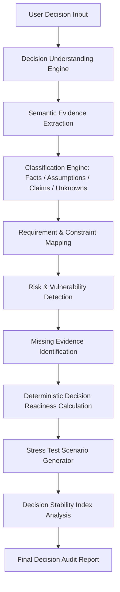
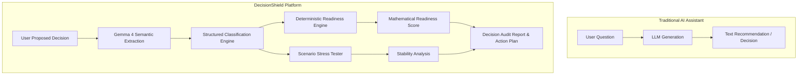
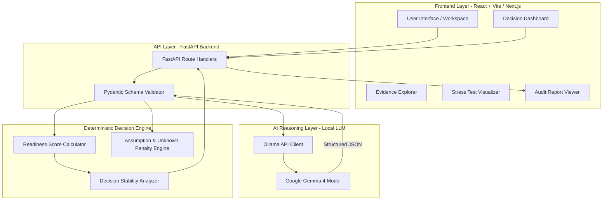
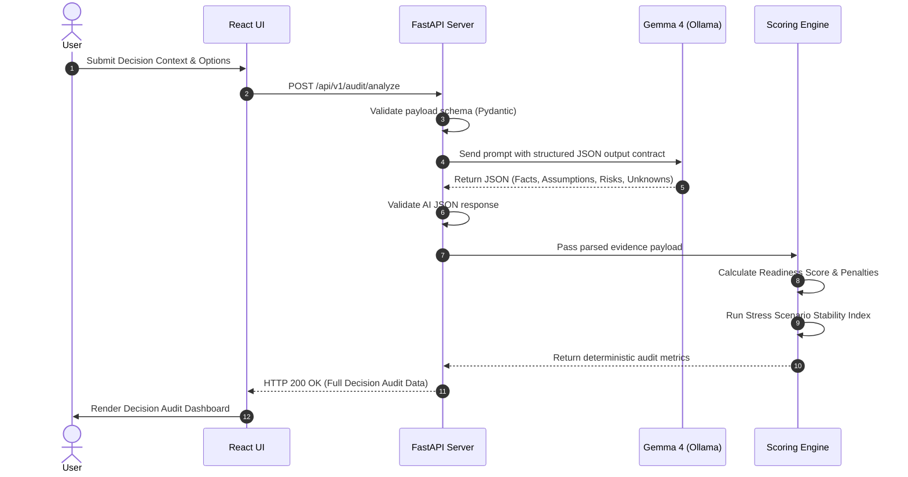
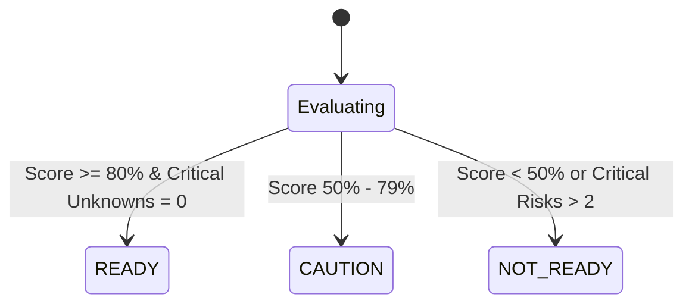

# 🛡️ DecisionShield

### *Know if you're ready to decide.*

> An open-source, AI-powered **Decision Readiness & Risk Auditing Platform** powered by **Google Gemma 4** and a **Deterministic Scoring Engine**.

---


---

## 📋 Table of Contents

- [1. Project Overview](#1-project-overview)
- [2. Problem Statement](#2-problem-statement)
- [3. Core Solution](#3-core-solution)
- [4. Key Features](#4-key-features)
- [5. Why This Is Not Just a Chatbot](#5-why-this-is-not-just-a-chatbot)
- [6. Gemma 4 Integration](#6-gemma-4-integration)
- [7. System Architecture](#7-system-architecture)
- [8. Data Flow](#8-data-flow)
- [9. Component Architecture](#9-component-architecture)
- [10. API Architecture](#10-api-architecture)
- [11. Decision Readiness Engine](#11-decision-readiness-engine)
- [12. Security & Reliability](#12-security--reliability)
- [13. Demo Scenario](#13-demo-scenario)
- [14. Project Differentiation](#14-project-differentiation)
- [15. Open Source & Licensing](#15-open-source--licensing)
- [16. Setup Instructions](#16-setup-instructions)
- [17. Environment Variables](#17-environment-variables)
- [18. Project Structure](#18-project-structure)
- [19. Future Roadmap](#19-future-roadmap)
- [20. Limitations](#20-limitations)
- [21. Hackathon & Innovation Value](#21-hackathon--innovation-value)
- [22. Screenshots](#22-screenshots)

---

## 1. Project Overview

> **Core Philosophy:** *"Don't ask AI what to choose. Ask AI if you're ready to choose."*

**DecisionShield** is **NOT** another conversational chatbot that simply picks Option A over Option B. 

Instead, DecisionShield is an open-source, AI-powered decision auditing platform designed to evaluate whether a high-stakes decision is **sufficiently supported by evidence** before an organization or individual commits resources to it.

```
┌─────────────────────────────────────────────────────────────────────────────┐
│                            TRADITIONAL AI ASSISTANT                         │
│  User: "Should we pick Vendor A or Vendor B?"                               │
│  AI: "Based on my analysis, pick Vendor A!" (Hallucinates confidence)       │
└─────────────────────────────────────────────────────────────────────────────┘

┌─────────────────────────────────────────────────────────────────────────────┐
│                                DECISIONSHIELD                               │
│  User: "We plan to choose Vendor A based on our team's evaluation."         │
│  DecisionShield: "Audit Result: NOT READY (Readiness Score: 42%)           │
│  - Missing Evidence: Vendor SLA under peak load is unverified.              │
│  - Load Assumption: 3 unsupported claims detected regarding pricing.        │
│  - High Risk: Data residency compliance is marked as Unknown."              │
└─────────────────────────────────────────────────────────────────────────────┘
```

### What DecisionShield Analyzes:
- **Facts**: Verifiable data points and confirmed parameters.
- **Assumptions**: Unverified beliefs treated as ground truth.
- **Claims**: Vendor or internal promises lacking supporting evidence.
- **Unknown Information**: Critical variables that are unaccounted for.
- **Requirements & Constraints**: Technical, financial, and operational boundaries.
- **Missing Evidence**: Information that could materially alter the decision.
- **Decision Stability**: How sensitive the decision is to changing external conditions.

The final artifact is a comprehensive **Decision Audit Report** containing a deterministic **Decision Readiness Score**, risk breakdown, and actionable verification steps.

---

## 2. Problem Statement

Modern leaders, engineers, and strategists increasingly rely on LLMs for critical decisions:
* **Technology & Architecture Selection** (e.g., database migrations, framework adoption)
* **Cloud & Infrastructure Platforms** (e.g., multi-cloud vs. single provider)
* **Vendor & Product Selection** (e.g., enterprise software procurement)
* **Business Strategy & Hiring** (e.g., expansion, team structuring)

### The Hidden Trap: "Confident Hallucination of Readiness"
Conventional LLM chatbots are optimized to answer questions persuasively. When given an incomplete problem statement, a standard AI assistant will frequently generate a recommendation without flagging that crucial information is missing.

#### Real-World Example:
A startup asks an AI assistant: *"Should we migrate from PostgreSQL to MongoDB?"*
* **Standard AI Response**: *"MongoDB offers flexible schema-less design and horizontal scalability, making it ideal for fast-growing startups..."*
* **The Reality**: The startup may suffer a catastrophic outage because no one verified whether their transactions require strict ACID guarantees, or what their read/write query distribution is.

#### How DecisionShield Reframes the Problem:
DecisionShield audits the decision foundation before any commitment is made:

| Element | Extracted Information | Status |
| :--- | :--- | :--- |
| **FACT** | Current database is PostgreSQL. Data size is 2 TB. | Verified |
| **ASSUMPTION** | MongoDB will automatically solve scalability bottlenecks. | **High Risk** |
| **UNKNOWN** | Query workload patterns (Read/Write ratio). | **Critical Gap** |
| **UNKNOWN** | Multi-document transaction frequency. | **Critical Gap** |
| **MISSING EVIDENCE**| Benchmark results under peak synthetic workloads. | **Required** |
| **RISK** | Relational data integrity models may break under MongoDB document structure. | **Warning** |

### The Paradigm Shift:

$$\text{Question} \longrightarrow \text{AI Recommendation} \quad \text{(High Risk Paradigm)}$$

$$\Downarrow$$

$$\text{Decision} \longrightarrow \text{Evidence Audit} \longrightarrow \text{Missing Info} \longrightarrow \text{Risk Analysis} \longrightarrow \text{Stress Test} \longrightarrow \text{Readiness Score} \longrightarrow \text{Human Decision}$$

---

## 3. Core Solution

DecisionShield executes an automated 11-stage decision auditing pipeline:



1. **User Decision Input**: User provides the proposed decision, candidate options, rationale, and supporting evidence.
2. **Decision Understanding**: Semantic analysis to parse context, goals, and domain.
3. **Evidence Extraction**: Natural language parsing to isolate individual evidence items.
4. **Item Classification**: Segregating inputs into *Facts*, *Assumptions*, *Claims*, and *Unknowns*.
5. **Requirement Analysis**: Validating how well stated options cover explicitly defined constraints.
6. **Risk Detection**: Flagging operational, technical, financial, and compliance risks.
7. **Missing Evidence Detection**: Identifying blind spots that could invalidate the decision.
8. **Deterministic Scoring**: Calculating an objective **Decision Readiness Score** (0-100%).
9. **Stress Testing**: Simulating external shocks (e.g., budget cut, traffic spike, team departure).
10. **Stability Analysis**: Measuring if the optimal choice flips under stress conditions.
11. **Decision Audit Report**: Rendering interactive visual dashboards and downloadable audit summaries.

---

## 4. Key Features

### 📁 Decision Workspace
- Input decision parameters, candidate options, organizational context, and known constraints.
- Attach raw text notes, requirement documents, and meeting summaries.

### 🧠 AI Evidence Parsing (Gemma 4)
- Automated extraction of facts, unverified assumptions, marketing claims, and missing details.
- Real-time semantic contradiction detection between stated requirements and proposed options.

### 📊 Deterministic Decision Readiness Score
- A non-hallucinated score computed by a pure Python mathematical backend.
- Evaluates 7 core metrics:
  1. *Evidence Quality*
  2. *Requirement Coverage*
  3. *Risk Coverage*
  4. *Assumption Load Penalty*
  5. *Unknown Information Penalty*
  6. *Evidence Completeness*
  7. *Decision Stability Index*

### 🔍 Missing Evidence Detection
- Pinpoints high-impact missing data required to safely finalize the decision (e.g., workload profiles, security compliance, latency benchmarks).

### ⚡ Decision Stress Testing
- Generates "what-if" edge case scenarios (e.g., "What if traffic increases 5x?", "What if team budget is cut 30%?").
- Tests whether the chosen option remains resilient under pressure.

### 📄 Comprehensive Audit Report
- Visual decision readiness gauge (`READY`, `CAUTION`, `NOT READY`).
- Prioritized checklist of verification actions required to bridge readiness gaps.

---

## 5. Why This Is Not Just a Chatbot

DecisionShield is built from the ground up to solve the architectural flaws of traditional conversational AI:



> **Key Takeaway:** The goal of DecisionShield is not to replace human judgment with AI recommendations. The goal is to audit and improve the **quality, completeness, and resilience of information** available to human decision makers.

---

## 6. Gemma 4 Integration

### Why Gemma 4?
DecisionShield leverages **Google's Gemma 4** open-weights model family (target model: `gemma4:e4b` / `gemma4:e2b` via **Ollama**) as its semantic reasoning backend. Gemma 4 provides state-of-the-art structured JSON generation, long-context reasoning, and fast local execution.

```
                      +---------------------------------------+
                      |         USER DECISION INPUT           |
                      +---------------------------------------+
                                          |
                                          v
                      +---------------------------------------+
                      |           GEMMA 4 REASONING           |
                      |     (Local Ollama Inference Engine)   |
                      |                                       |
                      |  - Unstructured Context Parsing       |
                      |  - Fact & Assumption Extraction       |
                      |  - Risk & Blind Spot Identification   |
                      |  - Stress Scenario Generation         |
                      +---------------------------------------+
                                          |
                                          | Strict JSON Output Schema
                                          v
                      +---------------------------------------+
                      |     DETERMINISTIC BACKEND ENGINE      |
                      |                                       |
                      |  - Mathematical Readiness Formula     |
                      |  - Penalty Calculation                |
                      |  - Audit Score Generation             |
                      +---------------------------------------+
```

### JSON Schema Contract
Gemma 4 strictly outputs standardized structured JSON payload to guarantee reliability:

```json
{
  "facts": [
    {"id": "f1", "statement": "Current database is PostgreSQL with 2TB storage.", "confidence": 0.95}
  ],
  "assumptions": [
    {"id": "a1", "statement": "MongoDB will reduce query latency automatically.", "risk_level": "HIGH"}
  ],
  "claims": [
    {"id": "c1", "statement": "Vendor guarantees 99.999% uptime.", "verified": false}
  ],
  "unknowns": [
    {"id": "u1", "statement": "Peak write IOPS under holiday traffic.", "criticality": "HIGH"}
  ],
  "risks": [
    {"id": "r1", "category": "Technical", "description": "Loss of ACID transactions across related documents.", "severity": "CRITICAL"}
  ],
  "missing_evidence": [
    {"id": "m1", "description": "Benchmark comparison of complex multi-join queries under MongoDB."}
  ],
  "stress_scenarios": [
    {"scenario": "Data volume grows from 2TB to 10TB in 6 months.", "impact": "HIGH"}
  ]
}
```

### Hardware Optimization Target
- **Recommended Model**: `gemma4:e4b` (Effective 4B parameters) or `gemma4:e2b` (Effective 2B parameters) with 4-bit quantization.
- **Minimum Requirements**: 16 GB RAM, 6 GB VRAM (runs entirely on local consumer hardware).

---

## 7. System Architecture

DecisionShield follows a decoupled client-server architecture separating semantic reasoning, deterministic scoring, and visualization:



---

## 8. Data Flow



---

## 9. Component Architecture

### Frontend Layout (`frontend/`)
```
frontend/
├── src/
│   ├── components/
│   │   ├── Workspace/          # Input forms for decision context
│   │   ├── Dashboard/          # Score gauges and status indicators
│   │   ├── EvidenceExplorer/   # Fact, assumption, and claim lists
│   │   ├── StressTest/         # Interactive scenario simulator
│   │   └── AuditReport/        # Printable and downloadable report views
│   ├── hooks/                  # Custom React hooks (useAudit, useOllama)
│   ├── services/               # API clients for FastAPI backend
│   ├── types/                  # TypeScript interfaces for audit schemas
│   └── App.tsx                 # Core application entry
├── package.json
└── vite.config.ts
```

### Backend Layout (`backend/`)
```
backend/
├── app/
│   ├── api/
│   │   └── routes.py           # FastAPI endpoints
│   ├── core/
│   │   ├── config.py           # Environment variables & constants
│   │   └── scoring.py          # Pure Python deterministic scoring formula
│   ├── models/
│   │   └── schemas.py          # Pydantic data models & JSON specs
│   ├── services/
│   │   ├── gemma_service.py    # Gemma 4 Ollama integration service
│   │   └── stress_service.py   # Stress testing simulation engine
│   └── main.py                 # FastAPI application entrypoint
├── requirements.txt
└── .env.example
```

---

## 10. API Architecture

The FastAPI backend exposes RESTful endpoints for evidence auditing and readiness evaluation:

| Endpoint | Method | Purpose | AI Involved | Status |
| :--- | :--- | :--- | :--- | :--- |
| `/api/v1/health` | `GET` | Health check & Ollama/Gemma connectivity check | No | Implemented |
| `/api/v1/audit/analyze` | `POST` | Full decision audit pipeline execution | **Yes (Gemma 4)** | Implemented |
| `/api/v1/audit/evidence` | `POST` | Extracts and classifies facts/assumptions | **Yes (Gemma 4)** | Implemented |
| `/api/v1/audit/score` | `POST` | Calculates readiness score deterministically | No | Implemented |
| `/api/v1/audit/stress-test`| `POST` | Generates edge-case stress scenarios | **Yes (Gemma 4)** | Implemented |
| `/api/v1/audit/export` | `POST` | Generates PDF / Markdown audit report | No | Planned |

---

## 11. Decision Readiness Engine

The **Decision Readiness Score** ($DRS$) is computed using a deterministic algorithm to ensure full reproducibility and eliminate LLM scoring hallucination.

### Mathematical Formulation

$$DRS = \max\left(0, \min\left(100, S_{\text{base}} - P_{\text{assumption}} - P_{\text{unknown}} - P_{\text{risk}} + B_{\text{evidence}}\right)\right)$$

Where:
* **Base Score ($S_{\text{base}}$)**: Baseline score determined by requirement coverage ratio:
  $$S_{\text{base}} = \left( \frac{N_{\text{covered requirements}}}{N_{\text{total requirements}}} \right) \times 60$$

* **Assumption Load Penalty ($P_{\text{assumption}}$)**:
  $$P_{\text{assumption}} = (N_{\text{high risk assumptions}} \times 10) + (N_{\text{medium risk assumptions}} \times 5)$$

* **Unknown Information Penalty ($P_{\text{unknown}}$)**:
  $$P_{\text{unknown}} = (N_{\text{critical unknowns}} \times 12) + (N_{\text{standard unknowns}} \times 6)$$

* **Unmitigated Risk Penalty ($P_{\text{risk}}$)**:
  $$P_{\text{risk}} = (N_{\text{critical risks}} \times 15) + (N_{\text{high risks}} \times 8)$$

* **Evidence Bonus ($B_{\text{evidence}}$)**:
  $$B_{\text{evidence}} = \min\left(20, N_{\text{verified facts}} \times 4\right)$$

### Decision Status Thresholds



| Status | Readiness Score | Action Required |
| :--- | :--- | :--- |
| 🟢 **READY** | $\ge 80\%$ | Decision is well-supported by evidence. Proceed with execution. |
| 🟡 **CAUTION** | $50\% - 79\%$ | Moderate evidence gaps. Address key assumptions before committing. |
| 🔴 **NOT READY** | $< 50\%$ | High risk / major blind spots. **Do not proceed** until missing evidence is verified. |

---

## 12. Security and Reliability

* **Deterministic Guardrails**: LLMs extract semantics; pure Python code calculates numbers.
* **Input Validation**: Strict typing via `Pydantic` and `TypeScript`.
* **JSON Schema Enforcement**: Strict JSON validation rejects malformed LLM outputs and triggers automatic re-prompts.
* **Local Data Privacy**: All LLM processing runs locally through Ollama—no sensitive business decisions are transmitted to 3rd-party clouds.
* **Disclaimer**: DecisionShield provides decision-support analytics and does not replace qualified human professional judgment.

---

## 13. Demo Scenario

### Scenario: *"Should our startup migrate from PostgreSQL to MongoDB?"*

#### User Context Input:
> *"We are experiencing query slowdowns on our startup's primary web application. Our dataset is around 2TB stored in PostgreSQL. We are considering migrating to MongoDB because document stores scale better horizontally."*

#### DecisionShield Output Summary:

```
================================================================================
                        DECISIONSHIELD AUDIT REPORT                             
================================================================================
DECISION TITLE: PostgreSQL to MongoDB Migration Evaluation
STATUS: 🔴 NOT READY
DECISION READINESS SCORE: 38%

--------------------------------------------------------------------------------
CLASSIFIED EVIDENCE:
--------------------------------------------------------------------------------
[FACT]           Current DB is PostgreSQL with 2TB storage volume. (Verified)
[ASSUMPTION]     MongoDB will automatically fix query latency. (High Risk)
[CLAIM]          Document databases scale better for all startup workloads. (Unverified)
[UNKNOWN]        Current Read/Write query ratio and index utilization. (Critical Gap)
[UNKNOWN]        Cross-collection ACID transaction requirements. (Critical Gap)

--------------------------------------------------------------------------------
CRITICAL MISSING EVIDENCE:
--------------------------------------------------------------------------------
1. Profiling report identifying exact query bottlenecks in PostgreSQL.
2. Estimated migration downtime and data conversion cost analysis.

--------------------------------------------------------------------------------
STRESS TEST RESULTS:
--------------------------------------------------------------------------------
Scenario: "Workload requires multi-table ACID transactions under high concurrency."
Impact: CRITICAL (MongoDB document model may require major application refactoring).

--------------------------------------------------------------------------------
RECOMMENDED ACTION PLAN:
--------------------------------------------------------------------------------
[ ] Perform query index profiling on existing PostgreSQL instance.
[ ] Measure current IOPS and latency metrics before changing database architecture.
================================================================================
```

---

## 14. Project Differentiation

| Dimension | Traditional Decision Matrix | Standard AI Chatbot | DecisionShield |
| :--- | :--- | :--- | :--- |
| **Approach** | Manual scoring grid | Conversational answer | Automated Evidence Audit |
| **Assumption Handling**| Ignored / Implicit | Accepts blindly | Explicitly flags & penalizes |
| **Blind Spot Detection**| Manual effort | Rare / Hallucinates | Automated Missing Evidence detection |
| **Scoring Mechanism** | Manual weight assignment| LLM-generated text | Deterministic mathematical engine |
| **Stress Testing** | Static | Ad-hoc text prompt | Automated edge-case simulations |

---

## 15. Open Source & Licensing

* **Open Source Philosophy**: DecisionShield is committed to privacy-first, local-first AI tools for transparent decision auditing.
* **License**: To be added.

---

## 16. Setup Instructions

### Prerequisites
* **Python**: 3.10 or higher
* **Node.js**: v18.0 or higher
* **Ollama CLI**: Installed and running locally ([https://ollama.com](https://ollama.com))

### 1. Model Setup (Gemma 4)
Ensure Ollama is running, then pull the target Gemma 4 model:
```bash
# Pull Gemma 4 model
ollama pull gemma4:e2b
# or for higher accuracy:
ollama pull gemma4:e4b
```

### 2. Backend Setup (FastAPI)
```bash
# Navigate to backend directory
cd backend

# Create virtual environment
python -m venv venv

# Activate virtual environment (Windows)
.\venv\Scripts\activate
# Activate virtual environment (Linux/macOS)
# source venv/bin/activate

# Install dependencies
pip install -r requirements.txt

# Start FastAPI development server
uvicorn app.main:app --reload --port 8000
```

### 3. Frontend Setup (React)
```bash
# Navigate to frontend directory
cd frontend

# Install node dependencies
npm install

# Start Vite development server
npm run dev
```

---

## 17. Environment Variables

Reference standard environment variables in `.env`:

```env
# Backend Settings
PORT=8000
ENVIRONMENT=development

# Gemma 4 / Ollama Configuration
OLLAMA_BASE_URL=http://localhost:11434
GEMMA_MODEL=gemma4:e2b
MAX_TOKENS=2048
TEMPERATURE=0.2

# CORS Configuration
ALLOWED_ORIGINS=http://localhost:5173,http://localhost:3000
```

---

## 18. Project Structure

```
DecisionShield/
├── backend/
│   ├── app/
│   │   ├── api/
│   │   │   └── routes.py
│   │   ├── core/
│   │   │   ├── config.py
│   │   │   └── scoring.py
│   │   ├── models/
│   │   │   └── schemas.py
│   │   ├── services/
│   │   │   ├── gemma_service.py
│   │   │   └── stress_service.py
│   │   └── main.py
│   ├── .env.example
│   └── requirements.txt
├── frontend/
│   ├── src/
│   │   ├── components/
│   │   │   ├── Workspace/
│   │   │   ├── Dashboard/
│   │   │   ├── EvidenceExplorer/
│   │   │   ├── StressTest/
│   │   │   └── AuditReport/
│   │   ├── hooks/
│   │   ├── services/
│   │   └── App.tsx
│   ├── package.json
│   └── vite.config.ts
└── README.md
```

---

## 19. Future Roadmap

- [ ] **PDF & Document Ingestion** *(Planned)*: Ingest PDFs, PRDs, and architecture blueprints directly into the evidence pipeline.
- [ ] **Collaborative Decision Rooms** *(Planned)*: Real-time multi-user auditing for leadership teams.
- [ ] **Source Citation & Provenance Graph** *(Planned)*: Visual mapping of every decision requirement to its source document.
- [ ] **Domain-Specific Audit Templates** *(Planned)*: Pre-built templates for Cloud Security, M&A, and Codebase Refactoring.

---

## 20. Limitations

* **LLM Edge Cases**: Semantic classification relies on language comprehension; human review is recommended.
* **Non-Exhaustive Blind Spots**: Missing evidence suggestions are based on provided context and may not capture unstated domain constraints.
* **Deterministic Indicator**: The readiness score measures evidence completeness and stability, not absolute real-world success guarantees.

---

## 21. Hackathon & Innovation Value

DecisionShield demonstrates novel innovation in local open-weights AI:
1. **Local-First Privacy**: Runs 100% locally via **Gemma 4** on Ollama—zero data exposure.
2. **Hybrid AI Architecture**: Combines LLM semantic understanding with non-hallucinating deterministic software logic.
3. **Structured Audit vs. Chatbot**: Moves past simple chat interfaces to structured, actionable enterprise auditing.

---

## 22. Screenshots

### Decision Workspace
<!-- Add screenshot here -->
*Input decision options, requirements, and context.*

### Decision Readiness Dashboard
<!-- Add screenshot here -->
*View non-hallucinated score gauges and decision status indicators.*

### Evidence Explorer
<!-- Add screenshot here -->
*Inspect classified facts, assumptions, claims, and unknowns.*

### Stress Test Simulator
<!-- Add screenshot here -->
*Simulate edge-case scenarios and evaluate decision stability.*

### Decision Audit Report
<!-- Add screenshot here -->
*Generate and share detailed decision audit reports.*
