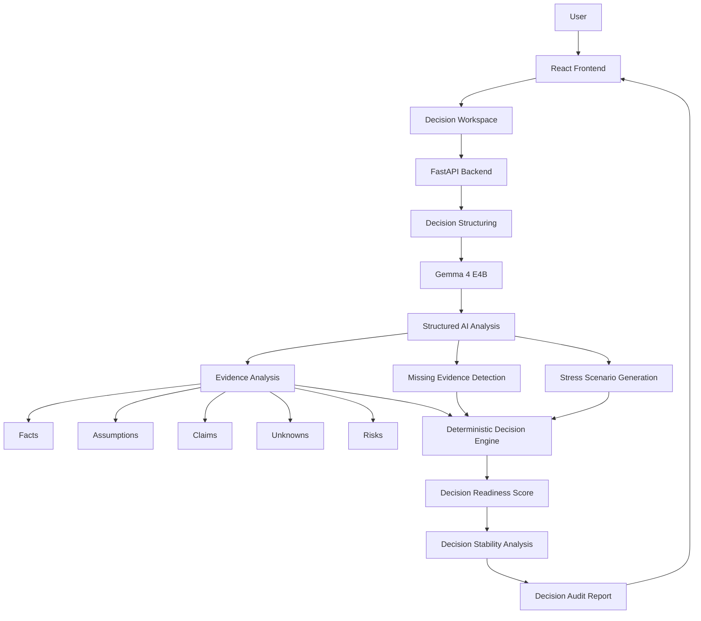

# DecisionShield

**AI-powered Decision Assurance Platform that analyzes evidence, exposes assumptions and risks, identifies missing information, and stress-tests important decisions before users commit.**

---

# Team

**Team Name:** [Team Name]

| Member | Contribution |
|---|---|
| [Member 1] | Full-stack development, AI integration and system architecture |
| [Member 2] | Frontend development, UI/UX and dashboard implementation |
| [Member 3] | Backend development, decision engine and API integration |
| [Member 4] | AI prompting, testing, documentation and presentation |

---

# Problem Statement

## The Problem

People increasingly use AI systems to make important decisions, from choosing technologies and vendors to planning products, selecting strategies and evaluating business options.

However, most AI assistants are optimized to **provide an answer or recommendation**, even when the information provided by the user is incomplete, uncertain or based on hidden assumptions.

For example, a user may ask:

> "Should our startup migrate from PostgreSQL to MongoDB?"

An AI assistant can provide a convincing recommendation, but the user may not have provided critical information such as:

- workload characteristics
- transaction requirements
- migration constraints
- budget limitations
- operational requirements
- compliance requirements

The result can be a confident decision based on incomplete evidence.

The core problem is therefore not simply:

> "Which option should I choose?"

It is:

> **"Do I have enough reliable evidence to make this decision?"**

DecisionShield addresses this gap by evaluating the **readiness, evidence quality, assumptions, risks and stability of a decision before commitment.**

---

## Why We Chose This Problem

AI systems are becoming increasingly capable of answering complex questions, but users can easily mistake a fluent answer for a well-supported decision.

We wanted to explore a different approach to AI-assisted decision making.

Instead of building another chatbot that tells users what to do, we wanted to build a system that encourages users to **think critically about the evidence behind their decisions**.

This is particularly important for high-impact decisions where incorrect assumptions can result in:

- financial losses
- wasted development effort
- poor technology choices
- operational problems
- failed product decisions
- unnecessary migration costs

DecisionShield therefore focuses on **decision quality rather than simply recommendation quality.**

---

# Solution

DecisionShield is an AI-powered **Decision Assurance Platform**.

Users provide a decision, available options, requirements, constraints and existing evidence.

The system then transforms the unstructured decision context into a structured decision model.

Gemma 4 analyzes the context to identify:

- Facts
- Assumptions
- Claims
- Unknowns
- Risks
- Missing evidence
- Potential failure conditions

A deterministic decision engine then evaluates the resulting analysis and calculates a **Decision Readiness Score**.

The decision can also be subjected to **stress tests**, where the system evaluates how stable it remains when important conditions change.

Finally, DecisionShield generates a **Decision Audit Report** containing:

- Decision Readiness
- Evidence Quality
- Requirement Coverage
- Risk Coverage
- Critical Assumptions
- Missing Evidence
- Stress-Test Results
- Decision Stability
- Recommended Verification Actions

The system does not attempt to replace the human decision maker.

Instead, it answers:

> **"Are you ready to make this decision?"**

---

# Key Features

### 1. Decision Workspace

Users can define:

- Decision
- Options
- Context
- Requirements
- Constraints
- Existing Evidence
- Decision Importance

---

### 2. Evidence Analysis

DecisionShield categorizes information into:

- Facts
- Assumptions
- Claims
- Unknowns
- Risks

This allows users to distinguish what they actually know from what they are assuming.

---

### 3. Decision Readiness Score

The platform calculates a deterministic readiness score based on factors such as:

- Evidence Quality
- Requirement Coverage
- Risk Coverage
- Unknown Information
- Assumption Load
- Decision Stability

The score provides an overall indication of whether the decision is sufficiently supported.

---

### 4. Missing Evidence Detection

DecisionShield identifies information that could materially change the decision.

Each missing evidence item includes:

- Severity
- Why it matters
- What should be verified
- Potential impact on decision readiness

---

### 5. Decision Stress Testing

Users can test scenarios such as:

- Increased workload
- Reduced budget
- Changing requirements
- Loss of team expertise
- New compliance requirements

The system evaluates how the decision's readiness changes under each scenario.

---

### 6. Decision Audit Report

The final report provides a structured summary of the decision, including:

- Readiness Score
- Evidence
- Assumptions
- Risks
- Unknowns
- Missing Evidence
- Stress Tests
- Decision Stability
- Recommended Next Actions

---

### 7. Decision History

Users can review previous decisions, compare readiness scores and identify decisions that require further attention.

---

### 8. Decision Drift

The architecture supports tracking whether the assumptions behind a previous decision remain valid as circumstances change.

A decision that was initially considered ready can therefore be flagged when important conditions change.

---

# Innovation and Differentiation

DecisionShield is not designed as another conversational AI assistant.

Traditional AI assistants primarily answer:

> **"What should I choose?"**

DecisionShield instead asks:

> **"What evidence supports this decision, what are we assuming, what are we missing, and would the decision remain valid if circumstances changed?"**

The primary innovation is the concept of **Decision Readiness**.

The platform separates:

```text
AI Reasoning
      ↓
Structured Evidence
      ↓
Deterministic Decision Analysis
      ↓
Decision Readiness
      ↓
Stress Testing
      ↓
Decision Audit
```

This creates a repeatable and auditable decision workflow rather than a single AI-generated response.

### Key differentiation

| Traditional AI Assistant | DecisionShield |
|---|---|
| Provides an answer | Audits a decision |
| Primarily conversational | Structured workflow |
| Recommendation-focused | Evidence-focused |
| Free-form response | Structured decision model |
| LLM-generated confidence | Deterministic readiness score |
| Limited evidence tracking | Fact/assumption/unknown classification |
| Static answer | Stress testing |
| One-time interaction | Decision history and potential drift detection |

DecisionShield does not claim that general-purpose LLMs cannot perform individual analysis tasks.

Instead, it packages AI reasoning into a **domain-independent decision assurance workflow**.

---

# Technical Implementation

## Architecture



---

# Technology Stack

| Category | Technologies |
|---|---|
| Frontend | React, Vite, Tailwind CSS, React Router, Framer Motion, Recharts |
| Backend | Python, FastAPI |
| Database | N/A for MVP / Local application state |
| AI / ML | Gemma 4 E4B, structured prompting |
| AI Runtime | Local inference / compatible Gemma inference runtime |
| Infrastructure | Local development / hackathon deployment |
| APIs / Services | FastAPI REST API |
| Visualization | Recharts |
| Icons | Lucide React |

---

# How It Works

## 1. Decision Intake

The user enters:

```text
Decision
Options
Context
Requirements
Constraints
Evidence
```

The frontend sends this structured information to the backend.

---

## 2. AI Reasoning

Gemma 4 analyzes the decision context.

Instead of returning an unrestricted conversational answer, the model is instructed to return structured information such as:

```json
{
  "facts": [],
  "assumptions": [],
  "claims": [],
  "unknowns": [],
  "risks": [],
  "missing_evidence": [],
  "stress_scenarios": []
}
```

This makes the AI output usable by downstream application logic.

---

## 3. Evidence Classification

The system separates information into categories.

### FACT

Information explicitly supported by the provided context.

### ASSUMPTION

A belief or inference that has not been sufficiently verified.

### CLAIM

A statement requiring additional evidence.

### UNKNOWN

Information that is currently unavailable.

### RISK

A potential condition that could negatively affect the decision.

---

## 4. Deterministic Decision Engine

The AI does not directly determine the final numerical score.

Instead, the backend calculates the Decision Readiness Score using measurable factors such as:

```text
Evidence Quality
Requirement Coverage
Risk Coverage
Unknown Information
Assumption Load
Decision Stability
```

This separation reduces dependence on arbitrary LLM-generated numerical confidence.

---

## 5. Missing Evidence

The system identifies unknown information that could materially change the decision.

Each item receives a priority such as:

```text
Critical
High
Medium
Low
```

The system then generates a verification action for each important gap.

---

## 6. Stress Testing

The platform generates hypothetical changes to the decision environment.

Examples:

```text
10× workload
50% budget reduction
New compliance requirement
Reduced team expertise
Increased operational complexity
```

The decision is evaluated again under these conditions.

This allows users to understand whether their decision is robust or highly sensitive to changing assumptions.

---

## 7. Decision Audit

The final analysis is presented as an auditable report.

Instead of:

> "MongoDB is better."

The system may produce:

> **Decision Readiness: 58/100 — NOT READY**

with the explanation:

```text
Critical unresolved evidence:
1. Query workload
2. Transaction requirements
3. Migration downtime tolerance
```

The user therefore understands what must be verified before committing.

---

# Technical Decisions

### LLM + Deterministic Engine

Gemma 4 is used for qualitative reasoning and unstructured information analysis.

The numerical Decision Readiness Score is calculated by deterministic backend logic.

This separation provides greater consistency and makes the scoring process explainable.

---

### Structured AI Output

The AI is instructed to produce structured JSON rather than unrestricted text.

This makes the model output easier to validate and integrate with the application.

---

### Model-Agnostic Architecture

The AI service is isolated from the rest of the application.

Although Gemma 4 is used for this implementation, the architecture allows another compatible model to be introduced later without redesigning the frontend or decision engine.

---

### No Database for the MVP

The hackathon MVP prioritizes the core decision-analysis workflow.

Persistent database infrastructure is intentionally minimized to reduce development complexity and keep the focus on the AI system.

---

# Implementation During the Hackathon

During the Hack Day, the team implemented a functional DecisionShield MVP covering the complete decision-analysis workflow.

The major components include:

- Decision Workspace
- Decision Dashboard
- Evidence Explorer
- Missing Evidence Analysis
- Decision Readiness Score
- Risk Analysis
- Stress Testing
- Decision Stability Visualization
- Final Decision Audit Report
- Decision History
- Authentication flow
- Responsive dashboard interface
- Gemma-powered reasoning layer
- Deterministic decision scoring engine

The MVP was designed around a representative technology decision:

> **Should a startup migrate from PostgreSQL to MongoDB?**

This scenario demonstrates how the platform identifies assumptions, unknowns and risks instead of simply producing a recommendation.

---

# Team Contributions

**[Member Name]:** System architecture, backend development, Gemma integration and decision engine.

**[Member Name]:** Frontend development, dashboard UI, responsive design and user experience.

**[Member Name]:** AI prompting, evidence analysis, stress-testing logic and evaluation.

**[Member Name]:** Testing, documentation, deployment, presentation and demo preparation.

---

# Working Application

**Live Application:** [Live URL]

The deployed application provides the complete DecisionShield workflow.

Users can:

1. Create or load a decision.
2. Submit it for analysis.
3. Review the Decision Readiness Score.
4. Explore facts, assumptions and risks.
5. Review missing evidence.
6. Verify evidence items.
7. Run decision stress tests.
8. Review decision stability.
9. Generate the final Decision Audit Report.

---

# Demo Video

**Demo Video:** [Video URL]

The demonstration should cover:

1. Landing page
2. Creating a decision
3. Decision analysis
4. Evidence classification
5. Decision Readiness Score
6. Missing evidence
7. Stress testing
8. Final Decision Audit Report

---

# Open Source and AI Usage

## AI / Models

### Gemma 4 E4B

**Usage:**

Gemma 4 is used as the reasoning engine of DecisionShield.

It analyzes unstructured decision context and identifies:

- Facts
- Assumptions
- Claims
- Unknowns
- Risks
- Missing evidence
- Stress-test scenarios

The application converts the model's output into structured data that is consumed by the decision-analysis engine.

Gemma is not used to directly generate the final numerical Decision Readiness Score.

---

# Open Source Components

### React

Used to build the interactive frontend application.

### Vite

Used as the frontend build tool and development environment.

### Tailwind CSS

Used for responsive UI styling and the DecisionShield design system.

### FastAPI

Used to build the Python backend and REST API layer.

### Recharts

Used to visualize readiness scores, decision stability and stress-test results.

### Framer Motion

Used for interface animations and transitions.

### Lucide React

Used for application icons.

All third-party components should retain their respective licenses and attribution requirements.

---

# Setup and Usage

## Prerequisites

- Node.js 20+
- Python 3.10+
- Git
- Compatible Gemma 4 inference environment
- Recommended hardware: 16 GB RAM and approximately 6 GB VRAM for the selected quantized Gemma configuration

---

# Installation

```bash
git clone [repository-url]

cd [project-directory]
```

## Frontend

```bash
cd frontend

npm install

npm run dev
```

## Backend

```bash
cd backend

python -m venv venv
```

### Windows

```bash
venv\Scripts\activate
```

### Linux / macOS

```bash
source venv/bin/activate
```

Install dependencies:

```bash
pip install -r requirements.txt
```

Run the API:

```bash
uvicorn main:app --reload
```

---

# Environment Variables

Create a `.env` file if required:

```env
GEMMA_MODEL_PATH=[path-to-local-gemma-model]
FRONTEND_URL=http://localhost:5173
API_URL=http://localhost:8000
```

Do not commit secrets or private credentials to the repository.

---

# Running the Project

Start the backend:

```bash
uvicorn main:app --reload
```

Start the frontend:

```bash
npm run dev
```

Open the frontend at:

```text
http://localhost:5173
```

---

# Usage

### Step 1

Open DecisionShield.

### Step 2

Create a new decision.

For example:

> Should our startup migrate from PostgreSQL to MongoDB?

### Step 3

Add:

- Options
- Requirements
- Constraints
- Context
- Existing evidence

### Step 4

Run the Decision Audit.

### Step 5

Review:

- Facts
- Assumptions
- Unknowns
- Risks
- Missing Evidence

### Step 6

Review the Decision Readiness Score.

### Step 7

Run Stress Tests.

### Step 8

Review Decision Stability.

### Step 9

Generate the Final Decision Audit.

---

# Challenges and Learnings

## Challenge 1 — Making AI reasoning structured

General-purpose LLMs naturally produce free-form responses.

We needed structured information that could be consumed reliably by application logic.

**Learning:**

Structured prompting and validation are critical when integrating LLMs into deterministic software systems.

---

## Challenge 2 — Avoiding arbitrary AI confidence scores

Allowing an LLM to directly generate a numerical decision score can make the result difficult to reproduce or explain.

**Solution:**

Gemma performs qualitative reasoning while the backend calculates the numerical readiness score.

---

## Challenge 3 — Making the system more than a chatbot

The goal was not to create another interface where users simply ask AI questions.

**Solution:**

We designed a complete workflow:

```text
Decision
   ↓
Evidence
   ↓
Assumptions
   ↓
Unknowns
   ↓
Risks
   ↓
Readiness
   ↓
Stress Test
   ↓
Audit
```

---

## Challenge 4 — Limited Hackathon Development Time

The system was designed around a focused MVP rather than attempting to implement every possible decision-management feature.

This allowed the team to prioritize the core AI workflow and demonstrate an end-to-end working product.

---

# Devpost Submission

**Devpost Project:** [Devpost Project URL]

The Devpost submission contains:

- Project description
- Problem statement
- Solution
- Architecture
- Technical implementation
- Team contributions
- Working application
- Demo video
- AI usage
- Open-source components
- Setup instructions

---

# Credits and License

## Credits

DecisionShield uses open-source technologies and frameworks including:

- React
- Vite
- Tailwind CSS
- FastAPI
- Recharts
- Framer Motion
- Lucide React

The project also uses Google's Gemma 4 model as the AI reasoning component.

All external technologies, models and libraries remain subject to their respective licenses and terms.

---

# License

**Apache License 2.0**

See:

```text
LICENSE
```

for the complete license text.

---

# Submission Checklist

- [x] Project title and description added
- [x] Problem clearly explained
- [x] Reason for choosing the problem explained
- [x] Solution documented
- [x] Key features documented
- [x] Innovation and differentiation explained
- [x] Architecture included
- [x] Technical implementation documented
- [x] AI architecture documented
- [x] Gemma 4 usage documented
- [x] Deterministic scoring engine documented
- [x] Hackathon implementation documented
- [x] Team contribution section added
- [x] All team member names finalized
- [ ] Working application link added
- [x] Demo video added
- [x] Repository URL added
- [x] Environment variables verified
- [x] Setup instructions tested
- [x] Challenges and learnings finalized
- [ ] Devpost project completed
- [ ] Devpost URL added
- [ ] Credits finalized
- [ ] License added
- [ ] Final end-to-end demo tested

---

# Core Product Statement

> **DecisionShield doesn't make the decision for you. It helps you determine whether you're ready to make it.**

**Analyze. Challenge. Stress-test. Decide.**
